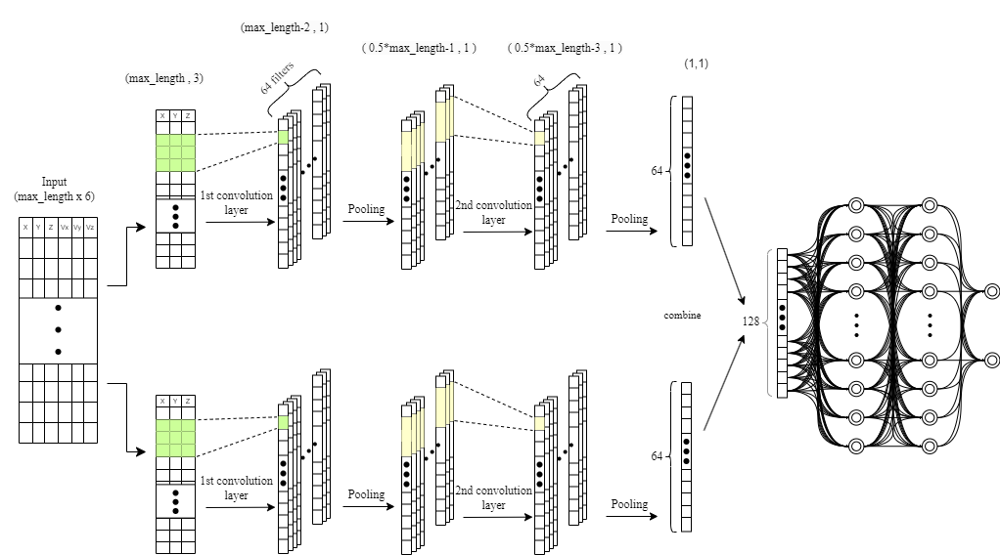
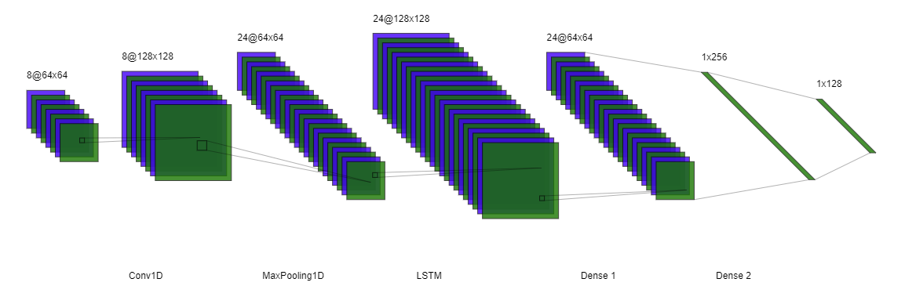
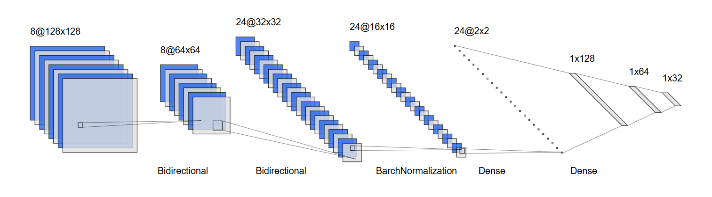
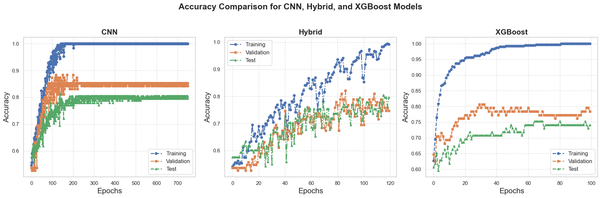
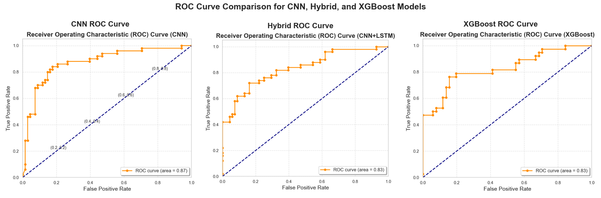

## Classification of Circulating Tumor Cells Using Machine Learning on Microfluidic Trajectory Data
<hr>


[](https://www.python.org/)
[](https://numpy.org/)
[](https://pandas.pydata.org/)
[](https://matplotlib.org/)
[](https://seaborn.pydata.org/)
[](https://scikit-learn.org/)
[](https://www.tensorflow.org/)
[](https://github.com/imsanjoykb/Text-Generation/LICENCE.txt)
[](https://doi.org/10.1000/100.102)

<hr>

## Abstract
>This study investigates the use of machine learning techniques to classify circulating tumor cells (CTCs) based on their movement patterns within a hyperuniform micropost microfluidic device. Utilizing cell-based modeling, a synthetic dataset was created to simulate the behavior of CTCs in blood flow. Three machine learning models were employed to analyze the trajectory data: a Convolutional Neural Network (CNN), a hybrid model combining CNNs and Long Short-Term Memory (LSTM) networks, and the eXtreme Gradient Boosting (XGBoost) algorithm. These models achieved an average classification accuracy of 80% in identifying distinct CTC phenotypes, demonstrating the potential of this method for early cancer detection.
<hr>

## Project Installation and Run

<b>Create the virtual environment</b>
```
pip install virtualenv
virtualenv venv 
venv\Scripts\activate  
```
<b>Install Dependencies</b>
```
pip3 install -r requirements.txt
```
<b>Run CNN Code/Notebook</b>
```
python CNN_Model.py
or,
CNN_Model.ipynb
```
<b>Run Hybrid Model Code/Notebook</b>
```
python Hybrid_Model.py
or,
Hybrid_Model.ipynb
```
<b>Run XGBoost Model Code/Notebook</b>
```
python XGBoost_Model.py
or,
XGBoost_Model.ipynb
```
<b>Run Final and Merge Model</b>
```
Final_Models.ipynb
```
<hr>

## CNN Architecture & Model

```python
def create_model(input_shape):
    # Separate inputs for position and velocity
    position_input = Input(shape=input_shape)
    velocity_input = Input(shape=input_shape)

    # Convolutions for position
    x_pos = Conv1D(64, kernel_size=3, activation='relu')(position_input)
    x_pos = MaxPooling1D(2)(x_pos)
    x_pos = Conv1D(64, kernel_size=3, activation='relu')(x_pos)
    x_pos = GlobalAveragePooling1D()(x_pos)

    # Convolutions for velocity
    x_vel = Conv1D(64, kernel_size=3, activation='relu')(velocity_input)
    x_vel = MaxPooling1D(2)(x_vel)
    x_vel = Conv1D(64, kernel_size=3, activation='relu')(x_vel)
    x_vel = GlobalAveragePooling1D()(x_vel)

    # Combine features
    combined = concatenate([x_pos, x_vel])

    # Dense layers
    x = Dense(128, activation='relu')(combined)
    x = Dense(64, activation='relu')(x)
    output = Dense(2, activation='softmax')(x)

    # Create model
    model = Model(inputs=[position_input, velocity_input], outputs=output)
    return model

def create_all_outputs_model(model):
    return Model(inputs=model.inputs, outputs=[layer.output for layer in model.layers])
```
<hr>

## Hybrid Model Architecture & Code

```python
def create_hybrid_model(input_shape):
    # Separate inputs for position and velocity
    position_input = Input(shape=input_shape)
    velocity_input = Input(shape=input_shape)

    # Convolutions for position
    x_pos = Conv1D(64, kernel_size=3, activation='relu')(position_input)
    x_pos = BatchNormalization()(x_pos)
    x_pos = MaxPooling1D(2)(x_pos)
    x_pos = Conv1D(64, kernel_size=3, activation='relu')(x_pos)
    x_pos = BatchNormalization()(x_pos)
    x_pos = LSTM(64, return_sequences=True)(x_pos)
    x_pos = GlobalAveragePooling1D()(x_pos)

    # Convolutions for velocity
    x_vel = Conv1D(64, kernel_size=3, activation='relu')(velocity_input)
    x_vel = BatchNormalization()(x_vel)
    x_vel = MaxPooling1D(2)(x_vel)
    x_vel = Conv1D(64, kernel_size=3, activation='relu')(x_vel)
    x_vel = BatchNormalization()(x_vel)
    x_vel = LSTM(64, return_sequences=True)(x_vel)
    x_vel = GlobalAveragePooling1D()(x_vel)

    # Combine features
    combined = concatenate([x_pos, x_vel])

    # Dense layers
    x = Dense(128, activation='relu')(combined)
    x = BatchNormalization()(x)
    x = Dropout(0.5)(x)
    x = Dense(64, activation='relu')(x)
    x = BatchNormalization()(x)
    output = Dense(2, activation='softmax')(x)

    # Create model
    model = Model(inputs=[position_input, velocity_input], outputs=output)
    return model
```
<hr>

## XGBoost Model Architecture & Code

```python
# Convert data to DMatrix for XGBoost
dtrain = xgb.DMatrix(X_train, label=y_train)
dval = xgb.DMatrix(X_val, label=y_val)
dtest = xgb.DMatrix(X_test, label=y_test)

params = {
    'objective': 'binary:logistic',
    'eval_metric': 'logloss',
    'max_depth': 6,
    'eta': 0.1,
}

# Train the model for multiple epochs
for epoch in range(num_epochs):
    model = xgb.train(params, dtrain, num_boost_round=1, xgb_model=model if epoch > 0 else None)

    # Predict probabilities
    y_train_pred_prob = model.predict(dtrain)
    y_val_pred_prob = model.predict(dval)
    y_test_pred_prob = model.predict(dtest)

    # Convert probabilities to binary predictions (threshold = 0.5)
    y_train_pred = (y_train_pred_prob > 0.5).astype(int)
    y_val_pred = (y_val_pred_prob > 0.5).astype(int)
    y_test_pred = (y_test_pred_prob > 0.5).astype(int)

    # Calculate and store accuracy
    train_acc.append(accuracy_score(y_train, y_train_pred))
    val_acc.append(accuracy_score(y_val, y_val_pred))
    test_acc.append(accuracy_score(y_test, y_test_pred))

print("Training complete!")
```
<hr>

## Result
### Accuracy Curve


### ROC Curve


## Citing
```
@misc{Microfluidic Data CTC Modeling,
  author = {Sanjoy Kumar, Yifan Wang, Huixin Zhan, Karl Gardner, Travis Thompson, and Wei Li},
  title = {Classification of Circulating Tumor Cells Using Machine Learning on Microfluidic Trajectory Data},
  year = {2024},
  publisher = {ICMLC-International Conference on Machine Learning and Computing},
}
```
<hr>


